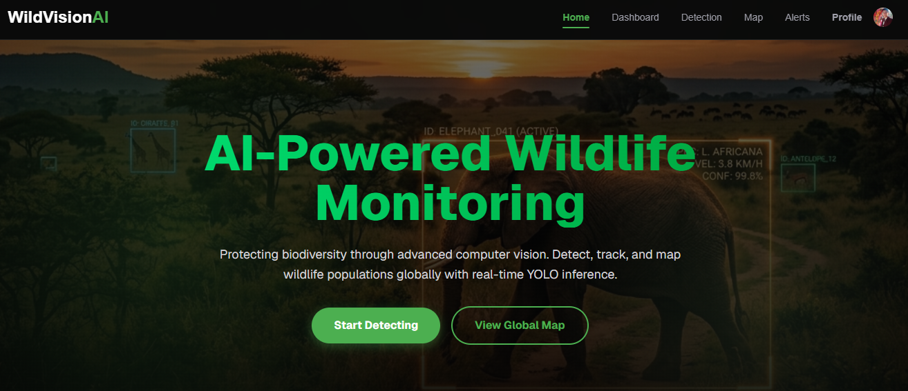
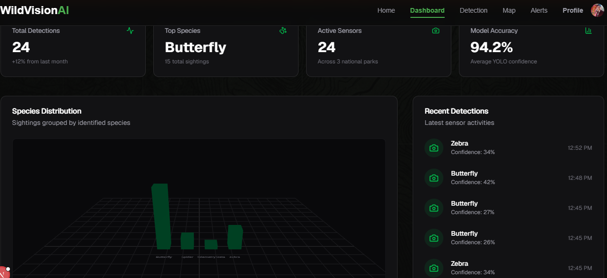
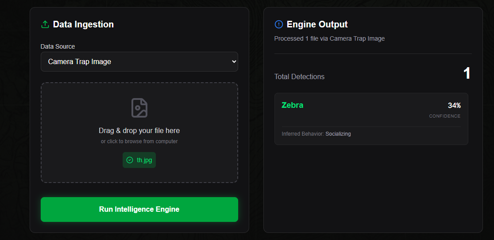
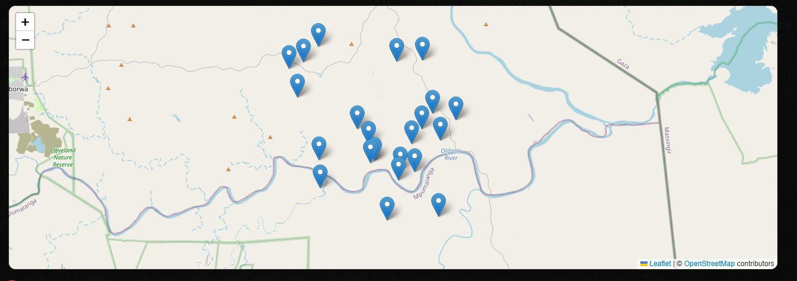
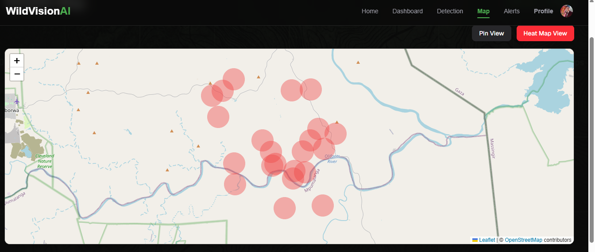
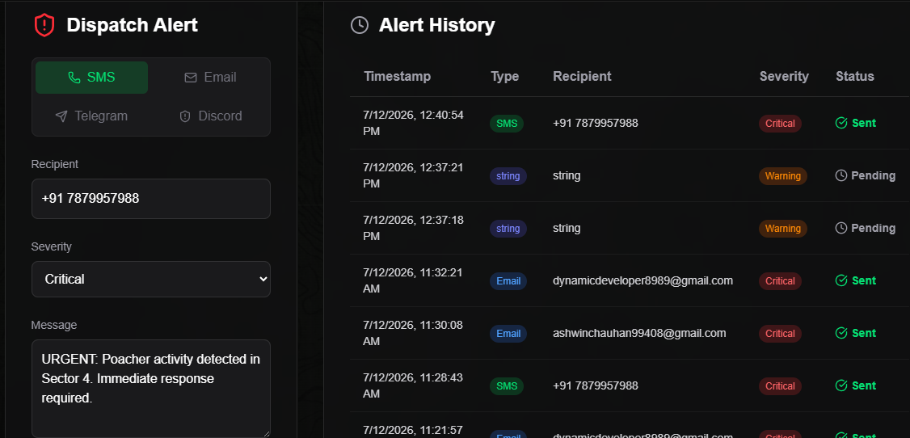
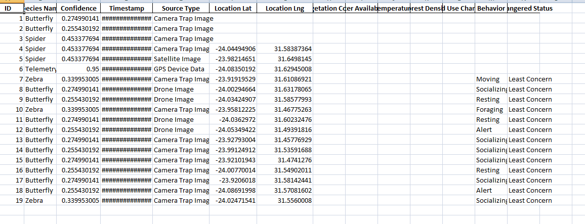

# EcoVision AI - Wildlife Population Intelligence System

<p align="center">
  <strong>AI-Powered Wildlife Monitoring, Population Analytics & Conservation Intelligence Platform</strong>
</p>

<p align="center">
  
  
  
  
  
  
  
  
  
</p>

<p align="center">
  <a href="#-overview">Overview</a> •
  <a href="#-features">Features</a> •
  <a href="#-architecture">Architecture</a> •
  <a href="#-installation">Installation</a> •
  <a href="#-api">API</a> •
  <a href="#-roadmap">Roadmap</a>
</p>

---

## 🌍 Overview

The **Wildlife Population Intelligence System** is an end-to-end AI-powered conservation platform designed to transform wildlife monitoring into a data-driven intelligence workflow.

The system combines **Computer Vision, Bioacoustic Analysis, Population Analytics, Habitat Intelligence, and Interactive Dashboards** to help researchers and conservation teams monitor wildlife populations and ecosystem health.

The platform can process multiple sources of wildlife data, including:

* 📷 Camera-trap imagery
* 🚁 Drone imagery
* 🎙️ Wildlife audio recordings
* 📊 Historical population observations
* 🌿 Habitat and ecosystem information

AI-powered processing transforms these inputs into actionable intelligence such as **species detections, confidence scores, population statistics, biodiversity trends, habitat insights, and conservation reports**.

> **Vision:** Build an intelligent digital infrastructure that enables faster, more accurate, and data-driven wildlife conservation decisions.

---

# ✨ Key Features

## 🤖 AI Wildlife Detection

The computer vision pipeline uses **Ultralytics YOLO** to analyze wildlife imagery.

### Capabilities

* 🐾 Wildlife species detection
* 🎯 Bounding-box generation
* 📊 Detection confidence scoring
* 🔎 Species classification
* 📷 Camera-trap image processing
* 🚁 Drone-image analysis
* 📈 Detection statistics

### Detection Pipeline

```text
Wildlife Image
      │
      ▼
Image Preprocessing
      │
      ▼
YOLO Detection Engine
      │
      ├── Species Detection
      ├── Bounding Boxes
      └── Confidence Scores
      │
      ▼
Wildlife Intelligence
      │
      ▼
Database Storage
      │
      ▼
Analytics Dashboard
```

---

# 🌿 Biodiversity Intelligence

The platform converts individual wildlife detections into higher-level ecological insights.

### Intelligence Modules

* Species distribution
* Population estimation
* Population trend analysis
* Habitat classification
* Animal behavior analysis
* Ecosystem health assessment
* Biodiversity monitoring
* Threat assessment
* Conservation insights

---

# 🎙️ Bioacoustic Intelligence

The platform also supports wildlife audio analysis.

### Current Capabilities

* 🎵 Audio upload
* 🔊 Wildlife sound processing
* 🐦 Species estimation
* 📊 Confidence estimation
* 📈 Acoustic pattern analysis

The current implementation includes a **mock AI bioacoustic engine**, providing an extensible architecture for integrating a production-grade audio classification model in the future.

### Bioacoustic Pipeline

```text
Audio Recording
      │
      ▼
Audio Upload
      │
      ▼
Feature Extraction
      │
      ▼
Species Prediction
      │
      ▼
Confidence Estimation
      │
      ▼
Acoustic Intelligence
```

---

# 📊 Analytics Dashboard

The web dashboard provides an interactive overview of wildlife and ecosystem data.

### Analytics

* 🐾 Total species detected
* 📈 Population trends
* 🌍 Species distribution
* 🗺️ Detection heatmaps
* 🌿 Habitat distribution
* ❤️ Ecosystem health score
* ⚠️ Threat assessment
* 📅 Monthly detection trends
* 🎯 AI confidence metrics

Charts and visualizations are implemented using **React and Recharts**.

---

# 👥 Role-Based Access Control

The platform provides dedicated workflows for different stakeholders.

| Role                        | Primary Responsibilities                                       |
| --------------------------- | -------------------------------------------------------------- |
| 👨‍🔬 **Researcher**        | Analyze wildlife data, species trends and research insights    |
| 🌳 **Conservation Officer** | Monitor population health, threats and conservation indicators |
| 🛠️ **Administrator**       | Manage users, system data and platform operations              |

Authentication is implemented using **JWT-based authentication** with protected API routes.

---

# 📄 Automated Reporting

The system provides automated wildlife intelligence reporting.

### Supported Reports

* Wildlife detection summaries
* Species statistics
* Population reports
* Conservation intelligence reports
* Analytical datasets
* Excel exports

### Reporting Stack

```text
Pandas
   │
   ▼
Data Processing
   │
   ▼
OpenPyXL
   │
   ▼
Excel Report
```

---

# 🏗️ System Architecture


---

# 🔄 End-to-End Data Flow

```text
Data Collection
      │
      ├── Camera Images
      ├── Drone Images
      └── Audio Recordings
      │
      ▼
AI Processing
      │
      ├── YOLO Detection
      └── Bioacoustic Analysis
      │
      ▼
Data Validation
      │
      ▼
Database Storage
      │
      ▼
Population & Biodiversity Analytics
      │
      ▼
Conservation Intelligence
      │
      ├── Dashboard
      ├── Visualizations
      └── Reports
```

---

# ⚙️ Technology Stack

## Frontend

| Technology        | Purpose                     |
| ----------------- | --------------------------- |
| **Next.js 15**    | Full-stack React framework  |
| **React 19**      | UI development              |
| **Tailwind CSS**  | Styling and responsive UI   |
| **Framer Motion** | Animations and interactions |
| **Recharts**      | Analytics and visualization |
| **Axios**         | API communication           |

## Backend

| Technology       | Purpose                 |
| ---------------- | ----------------------- |
| **Python 3.11+** | Backend development     |
| **FastAPI**      | REST API framework      |
| **SQLAlchemy**   | ORM                     |
| **SQLite**       | Development database    |
| **JWT**          | Authentication          |
| **Pandas**       | Data analysis           |
| **OpenPyXL**     | Excel report generation |

## Artificial Intelligence

| Technology             | Purpose                   |
| ---------------------- | ------------------------- |
| **Ultralytics YOLO**   | Wildlife object detection |
| **OpenCV**             | Image processing          |
| **NumPy**              | Numerical computation     |
| **Bioacoustic Engine** | Wildlife audio analysis   |

## DevOps & Development

| Technology         | Purpose                     |
| ------------------ | --------------------------- |
| **Docker**         | Containerization            |
| **Docker Compose** | Multi-service orchestration |
| **Git**            | Version control             |
| **GitHub**         | Source-code collaboration   |

---

# 📂 Project Structure

```text
Wildlife-Population-Intelligence-System/
│
├── backend/
│   │
│   └── wildlife-backend/
│       ├── api/
│       ├── database/
│       ├── models/
│       ├── schemas/
│       ├── services/
│       ├── results/
│       ├── uploads/
│       ├── utils/
│       │
│       ├── alembic/
│       ├── .gitignore
│       ├── alembic.ini
│       ├── Dockerfile
│       ├── label_encoder.pkl
│       ├── scaler.pkl
│       ├── main.py
│       ├── requirements.txt
│       ├── test_alerts.py
│       └── README.md
│
├── frontend/
│   │
│   └── wildlife-frontend/
│       ├── app/
│       ├── components/
│       ├── hooks/
│       ├── lib/
│       ├── public/
│       └── package.json
│
├── docker-compose.yml
├── .gitignore
├── README.md
└── LICENSE
```

---

# 🚀 Installation

## Prerequisites

Make sure the following tools are installed:

* Python **3.11+**
* Node.js **18+**
* npm
* Git
* Docker Desktop *(optional but recommended)*

---

# 🐳 Option 1 — Docker Setup

Docker is the recommended approach for a consistent development environment.

### 1. Clone the repository

```bash
git clone https://github.com/yourusername/Wildlife-Population-Intelligence-System.git
```

### 2. Navigate into the project

```bash
cd Wildlife-Population-Intelligence-System
```

### 3. Build and start the services

```bash
docker compose up --build
```

### 4. Run in detached mode

```bash
docker compose up -d
```

### 5. Stop services

```bash
docker compose down
```

---

# 💻 Option 2 — Local Development

## Backend Setup

Navigate to the backend:

```bash
cd backend/wildlife-backend
```

Create a virtual environment:

### Windows

```bash
python -m venv venv
venv\Scripts\activate
```

### Linux / macOS

```bash
python3 -m venv venv
source venv/bin/activate
```

Install dependencies:

```bash
pip install -r requirements.txt
```

Start the FastAPI server:

```bash
uvicorn main:app --reload
```

Backend:

```text
http://localhost:8000
```

---

# 🌐 Frontend Setup

Open another terminal:

```bash
cd frontend/wildlife-frontend
```

Install dependencies:

```bash
npm install
```

Start the development server:

```bash
npm run dev
```

Frontend:

```text
http://localhost:3000
```

---

# 📡 Backend API Documentation

FastAPI automatically generates interactive API documentation.

### Swagger UI

```text
http://localhost:8000/docs
```

### ReDoc

```text
http://localhost:8000/redoc
```

These interfaces can be used to inspect and test available REST endpoints.

---

# 🔑 Authentication

The backend uses **JWT-based authentication**.

Authenticated requests should provide a Bearer token:

```http
Authorization: Bearer <your-access-token>
```

### Supported Roles

```text
Researcher
Conservation Officer
Administrator
```

Protected resources require appropriate authentication and authorization.

---

# 📡 API Overview

> Endpoint names may evolve as the backend API is expanded. The Swagger documentation at `/docs` should be treated as the source of truth for the current implementation.

| Method | Endpoint        | Purpose                      |
| ------ | --------------- | ---------------------------- |
| `POST` | `/login`        | Authenticate a user          |
| `POST` | `/detect`       | Process wildlife imagery     |
| `POST` | `/upload-audio` | Analyze wildlife audio       |
| `GET`  | `/species`      | Retrieve species information |
| `GET`  | `/dashboard`    | Retrieve analytics           |
| `GET`  | `/reports`      | Retrieve generated reports   |


---

# 🎙️ Bioacoustic Workflow

```text
Audio Recording
      │
      ▼
Audio Upload
      │
      ▼
Preprocessing
      │
      ▼
Feature Extraction
      │
      ▼
Species Prediction
      │
      ▼
Confidence Estimation
      │
      ▼
Acoustic Intelligence
      │
      ▼
Conservation Report
```

---

# 📈 Intelligence Dashboard

The dashboard transforms raw wildlife detections into decision-support metrics.

### Key Indicators

```text
Species Diversity
       │
       ├── Species Count
       ├── Species Distribution
       └── Biodiversity Trends

Population Health
       │
       ├── Population Estimates
       ├── Growth Trends
       └── Detection Frequency

Ecosystem Health
       │
       ├── Habitat Distribution
       ├── Threat Indicators
       └── Ecosystem Score
```

---

# 📸 Screenshots

## 🖥️ Main Dashboard

<p align="center">
  
</p>

---

## 🔬 Research Dashboard

<p align="center">
  
</p>

---

## 🎯 AI Wildlife Detection

<p align="center">
  
</p>

---

## 📊 Species Analytics

<p align="center">
  
</p>

---

## 📈 Population Insights

<p align="center">
  
</p>

---

## 📄 Report Generator

<p align="center">
  
</p>

---

## 📑 Conservation Report

<p align="center">
  
</p>

---

# 🧪 Testing

## Backend

Run backend tests with:

```bash
pytest
```

For more verbose output:

```bash
pytest -v
```

## Frontend

Run the frontend test suite:

```bash
npm test
```

---

# 🔐 Environment Variables

Never commit secrets, API keys, credentials, or private configuration to Git.

Create a local environment file when required:

```text
.env
```

Example:

```env
DATABASE_URL=your_database_url
SECRET_KEY=your_secret_key
JWT_SECRET=your_jwt_secret
```

> Keep `.env` in `.gitignore`.

---

# 🌱 Git Workflow

The project follows a feature-branch workflow.

Create a feature branch:

```bash
git checkout -b feature/your-feature
```

Make your changes and commit:

```bash
git add .
git commit -m "Add wildlife detection feature"
```

Push your branch:

```bash
git push origin feature/your-feature
```

Then open a Pull Request for review.

### Recommended Branch Structure

```text
main
│
├── feature/wildlife-detection
├── feature/bioacoustic-analysis
├── feature/dashboard
├── feature/report-generation
└── feature/authentication
```

---

# 📄 License

This project is licensed under the **MIT License**.

See the [`LICENSE`](LICENSE) file for details.

---

# 👨‍💻 Author

## Ashwin Chauhan - Team 1

**Computer Science Engineer**

Focused on building practical software solutions across:

```text
AI
Computer Vision
Machine Learning
Full-Stack Development
FastAPI
Next.js
Python
Docker
```

---

# 🏆 Project Highlights

```text
┌─────────────────────────────────────────────┐
│       WILDLIFE POPULATION INTELLIGENCE      │
├─────────────────────────────────────────────┤
│                                             │
│   📷 Computer Vision                       │
│          +                                  │
│   🎙️ Bioacoustic Intelligence              │
│          +                                  │
│   🌿 Biodiversity Analytics                │
│          +                                  │
│   📊 Population Intelligence               │
│          +                                  │
│   🌍 Conservation Technology               │
│                                             │
│                 =                           │
│                                             │
│       DATA-DRIVEN WILDLIFE                 │
│          CONSERVATION                      │
│                                             │
└─────────────────────────────────────────────┘
```

---

## 🌟 Why This Project?

Wildlife conservation increasingly depends on the ability to collect, process, and interpret large amounts of ecological data.

The **Wildlife Population Intelligence System** demonstrates how modern **Artificial Intelligence, Computer Vision, Bioacoustics, Data Analytics, and Full-Stack Engineering** can be integrated into a unified conservation platform.

Instead of treating wildlife observations as isolated records, the system aims to transform them into **actionable conservation intelligence**.

The project provides a foundation for future capabilities such as real-time wildlife monitoring, population forecasting, geospatial intelligence, automated threat detection, and large-scale biodiversity analytics.

> **Technology for wildlife. Intelligence for conservation. 🌍🦁**
